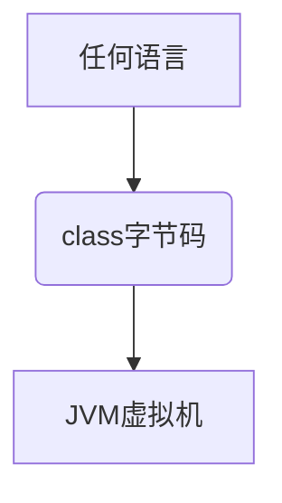

#### JVM基础

##### java从编码到执行


##### JVM：从跨平台的语言到跨语言的平台


##### jvm

java虚拟机 java virtual machine 

###### jvm是一种规范

- java虚拟机规范 java virtual machine specifications

###### jvm是虚构出来的一台计算机

- 字节码指令集（汇编语言）
- 内存管理：栈 堆 方法区等

###### jvm分代模型

- 新生代（Young Generation）
- 老年代（(Old Generation）
- ~~持久代（Permanent Generation）~~：用于存储静态文件

JDK 8 中已经把持久代（PermGen Space）移除了，取而代之的元空间（Metaspace）。Metaspace占用的是本地内存，不再占用虚拟机内存。

##### jvm与class文件格式

jvm与java无关，任何语言都可以通过编译成字节码文件在jvm上运行。



##### 常见的JVM实现

###### Hotspot

- Oracle官方，做实验用的JVM
- java -version

###### Jrockit

- BEA公司开发，曾经号称世界上最快的JVM
- 被Oracle收购

###### J9-IBM

IBM公司开发，类似于Hotspot，主要用于IBM自己的产品。

###### Microsoft VM

微软虚拟机

###### TaobaoVM

Hotspot深度定制版

###### LiquidVM

直接针对硬件

###### azul zing

最新垃圾回收的行业标杆

##### JDK-JRE-JVM

JDK：开发集成工具+jre，java开发工具包，部署java开发环境

JRE：核心库+jvm，运行java环境

JVM：运行最终的字节码文件


<!--more-->

#### Garbage Collector 与 GC tuning

垃圾回收与垃圾回收调优

##### 垃圾的定义

内存

- 多删
- 忘删：内存泄漏（Memory Leak）

JVM中GC自动回收垃圾

###### java与c++垃圾回收比较

java

- GC处理垃圾
- 开发效率高，执行效率低

C++

- 手动处理垃圾
- 忘记回收：内存泄漏
- 回收多次：非法访问
- 开发效率低，执行效率高

##### 垃圾的定位

垃圾是如何定位的

###### Reference Count 算法

引用计数

在空引用时进行回收

缺陷：RC不能解决循环引用的问题（一堆垃圾）

###### Root Searching 根可达算法

由根节点可以连接到达为有效对象，其他的视为垃圾。

以下可视为根节点

- JVM stack	main方法的栈帧
- native method  stack 本地方法栈
- runtime constant pool 运行时的常量池
- static references in method area 方法区内静态引用对象
- Clazz 类对象

GC roots：线程变量、静态变量、常量池、JNI指针

注意：

Java 不采用RC（Reference Count）算法，而是采用RS（Root Searching）算法。

##### 常见垃圾回收算法

常见GC 算法

- Mark-Sweep 标记清除
- Copying 拷贝
- Mark-Compact 标记压缩

###### Mark-Sweep 标记清除


标记清除算法流程


优点：

- 算法相对简单
- 存活对象比较多的情况下效率较高

缺点：

- 扫描两次，效率偏低
- 容易产生碎片化：不能存放连续的对象

###### Copying 复制


复制算法流程


优点：

- 适用于存活对象较少的情况
- 只扫描一次，效率提高
- 没有碎片

缺点：

- 空间浪费，每次只有一半内存被使用
- 移动复制对象，需要调整对象的引用

###### Mark Compact 标记压缩


标记压缩算法流程


优点：

- 不会产生碎片，方便对象分配
- 不会产生内存减半

缺点：

- 扫描两次
- 需要移动对象，效率偏低

##### 垃圾回收器

- JDK 1.8默认 PS+PO

- JDK 1.9 10 11 12 13 默认G1

###### 常见垃圾回收器分类


Young、Old 分代模型，新生代和老生代配合使用

- ParNew+CMS
- ParNew+Serial Old
- Serial+Serial Old
- Serial+CMS+Serial Old
- Parallel Scavenge+Parallel Old
- Parallel Scavenge+Serial Old

G1：物理上不分代，逻辑上分代

###### 堆内存逻辑分区（不适用不分代垃圾收集器）

新生代大量死去，少量存活，采用复制算法

老年代存活率高，回收较少，采用MC（Mark Compact）或MS（Mark Sweep）


CMS：经过6次GC-->老年代

其他：经过15次GC

###### GC概念

MinorGC/YGC：年轻代空间耗尽时触发

MajorGC/FullGC：在老年代无法继续分配空间时触发，新生代老年代同时进行回收


###### GC详解

栈上分配

- 线程私有小对象
- 无逃逸：栈中存在引用
- 支持标量替换
- 无需调整

线程本地分配TLAB（Thread Local Allocation Buffer）

- 占用eden，默认1%
- 多线程的时候不用竞争eden就可以申请空间，提高效率
- 小对象
- 无需调整

Old 老年代

- 大对象

eden 伊甸：对象刚出生时，刚new的时候

###### YGC与FGC

YGC

- Young GC Minor（辅助） GC
- Eden区不足

FGC

- Full GC Major GC
- Old空间不足
- System.gc()

###### 对象何时进入老年代

超过`XX:MaxTenuringThreshold`指定次数（YGC）

- Parallel Scavenge 经过15次GC进入老年代
- CMS 经过6次GC进入老年代
- G1 经过15次GC进入老年代

动态年龄

- s1 - > s2超过50%
- 把年龄最大的放入O（老年代）

通过参数：`-XX:MaxTenuringThreshold`配置


###### 总结


###### ParNew垃圾回收器

PS（Parallel Scavenge）的变种，用来配合CMS使用。

- a stop-thr-world,copying collector with uses multiple GC threads.
- It differs from "Parallel Scavenge" in that it has enhancements that make it uasable with CMS.
- For example,"ParNew" doses the synchronization needed so that it can run during thr concurrent phases of CMS.
- 默认线程数位CPU的核数

###### Serial垃圾回收器与Serial Old垃圾回收器

此种组合基本不使用，效率太低


- 串行
- STW
- 单线程拷贝算法（工作在年轻代）


###### Parallel Scavenge垃圾回收器

- STW
- 多线程拷贝算法

###### Parallel Old垃圾回收器

A compacting collector that uses multiple GC threads.

- 多线程压缩算法（工作在老年代）

###### CMS垃圾回收器

- 并发标记清理concurrent mark sweep
- 高并发低停顿收集器a mostly concurrent，low-pause collector
- 4个阶段（从线程角度）
  1. 初始标记initial mark
  2. 并发标记concurrent mark
  3. 重新标记remark
  4. 并发清理concurrent sweep

###### CMS垃圾回收器缺点

- memory fragmentation
  - -XX:CMSFullGCsBeforeCompaction
- floating garbage
  - Concurrent Mode Failure -XX:CMSInitiatingOccupancyFraction 92%
  - SerialOld

###### CMS Remark阶段的算法

三色扫描算法：白灰黑


在并发按标记时，引用可能产生变化，白色对象有可能被错误回收

解决方案

- SATB
  - 在起始的时候做一个快照 snapshot at the beginning
  - 当B->D消失时，要把这个引用推到GC的堆栈，保证D还能被GC扫描到
  - 配合RSet，只用扫描哪些Region引用到D这个Region（区域）了
- Incremental Update
  - 当一个白色对象被一个黑色对象引用
  - 将黑色对象重新标记为灰色，让collector重新扫描
  - 这个容易产生问题，比如 A a， A b 都已经标记完，但是 A  a - D了，A成为灰色，这时mutator（设置方法）把A a 标记完了，又把 A变成了黑色
  - 这也是为什么CMS的final mark必须再扫描一遍地原因

##### JVM调优

###### 什么是调优

1. 根据需求进行JVM规划和预调优
2. 优化运行JVM运行环境（慢、卡顿）
3. 解决JVM运行过程中出现的任何问题（OOM）

###### 调优方式

简单粗暴的调优方式：重启

在线调优

##### JVM命令行参数

HotSpot参数分类

- 标准：`-`开头，所有的HotSpot都支持

- 非标准：`-X`开头，特定版本HotSpot支持特定命令

- 不稳定：`-XX`开头，下个版本可能取消

  ```shell
  java 								# 列出所有的HotSpot都支持的命令
  
  java -X								# 列出特定版本HotSpot支持的特定命令
  
  Java -XX:+PrintFlagsWithComments	# 只有debug版本能用
  java -XX:+PrintFlagsFinal			# 列出所有不稳定命令
  ```

##### JVM调优实战

将xms（程序启动时初始内存大小），xmx（程序运行时最大可用内存大小）设置成一致的好处是可以防止内存抖动。

###### 问题背景

OOM（Out Of Memory）：内存泄漏、内存溢出

当程序的GC垃圾回收在执行，而Memory只增不降，需要进行调优。

当执行到一定时间时，最终频繁Full GC ，每次GC只会回收2kB或1kB。

###### 工具

阿里开源JVM在线调优工具 arthas

文档：[Arthas](https://alibaba.github.io/arthas/)

Arthas无法替代jvm唯一的命令jmap

```shell
top # 类似于任务管理器，通过此命令找到java程序运行的端口号
top -Hp 1196 # 可以查看该进程下各个线程的cpu使用情况；
jps # 用于查询正在运行的JVM进程
jstat # 可以实时显示本地或远程JVM进程中类装载、内存、垃圾收集、JIT编译等数据
jmap -histo 1196 | head -20		# 1196为运行端口号，以实际为主，20为获取前面的数据
```

问题：当服务器cpu出现飙高怎么处理

1. 业务线程：列出堆栈，通过`jmap`命令找到占用内存最高的对象，无法进行GC处理掉的对象，查看代码，进行调整。
2. GC线程：通过在线调优工具进行排查

导致Full GC的原因：

- 年老代（Old）被写满
- 持久代（Perm）被写满
- `System.gc()`被显示调用

